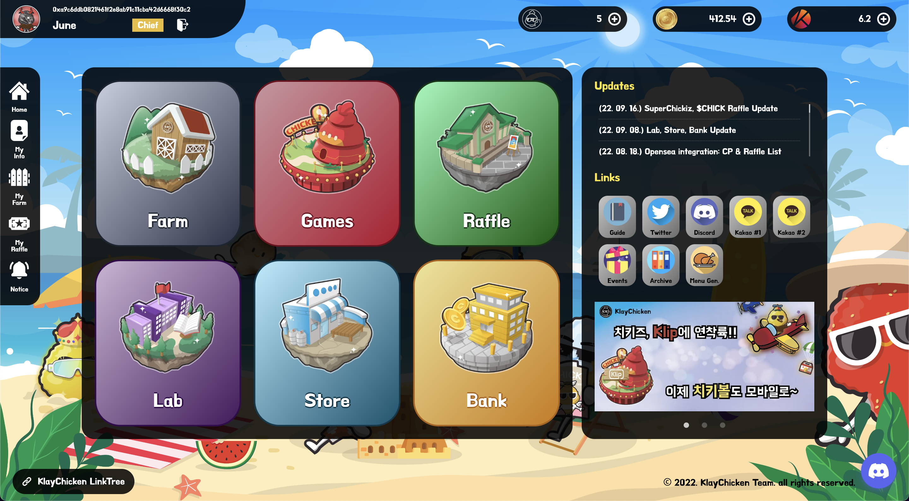

# ChickiFarm

ChickiFarm is an NFT-based playground where every holder can enjoy various experiences. Our platform provides services such as social-networking, games, raffles, shopping, and customizing your own NFT space.

## About

NFTs have been all the rage for a while, and as of today, approximately 26 million people hold at least one NFT in a 3 billion dollar market.

However, the truth is that technically, there’s **no place to make use of your NFTs**. You buy one, maybe use it as your profile picture, but then what? NFT use cases were scarce, and that’s bad news for everyone in the industry.

  

ChickiFarm offers the solution. Those NFTs you own that seem rather useless, can be your ticket to **having fun in a Web3 space**.

It comes in a whole action-packed, fun-filled assortment of activities to do.

Games, Raffles, Shopping, and decorating your own NFT blog are available on our platform. The ecosystem revolves around our domestic token.

### Built With

- nextjs
- caver-js
- Solidity
- BlockPI RPC service
- nodejs
- My SQL
- Klip API (APP2APP SDK)

## How To

All you need to use our platform is your wallet and our NFT. Simply sign up and make your account, and you’re good to go!

Our platform consists of mainly **6 functions**, with a social networking space and raffle as its main feature. The ecosystem revolves around our token and NFTs.

### [Farm]

Every user owns a “farm”, where holders can customize their private space with ornaments and NFTs.

- Cultivate your Web 3.0 identity via ChickiFarm.
- Private space to display your NFTs and express yourself.

### [Games]

A space to enjoy games and entertainment to win prizes/awards.

- ChickiBall: Our flagship game, a daily number puzzle to find a 4 digit answer.
- Minigames: Linked to our official Discord channel, where you can trade tokens for real life prizes.
- Random Generator: Recommends chicken menu options for dinner.
- Roulette(TBD)

### [Raffle]

A marketplace to create or enter NFT raffles and whitelists.

- Klaytn’s very first raffle system.
- Registered/verified NFT projects only.
- The whole process(draw, escrow, distribution etc.) is based on a smart contract.

### [Lab]

A place to experiment and explore your NFT’s possibilities.

- Mining: Stake your NFT to mine and claim utility tokens($CHICK).
- SuperChickiz: Upgrade your NFT using a special oil for higher yields and better looks.
- ChickiPedia: An encyclopedia of the list of NFTs registered.
- Burn(TBD)

### [Store]

Shop items and NFTs to decorate your farm and mine tokens.

### [Bank]

Swap $CHICK with Klay or vice versa.

## Contact

KlayChicken - @klaychicken - klaychicken@gmail.com

Project Link: [https://chickifarm.com](https://chickifarm.com/)
